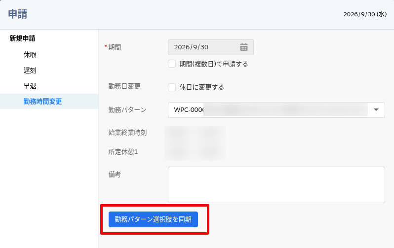
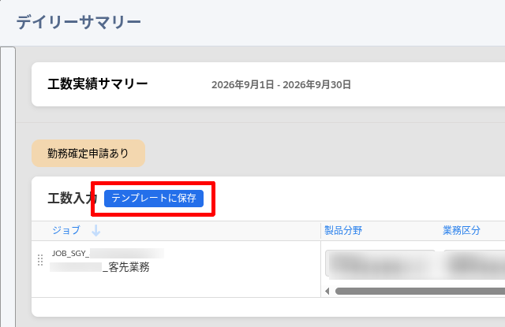
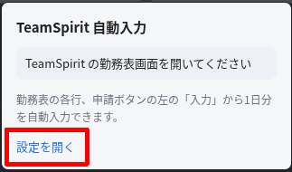

# TeamSpirit 自動入力

TeamSpirit の勤務表画面で、1日1行分の勤務パターン、出退勤時刻、勤務場所、業務内容、工数実績を自動入力します。

日々の定型単純作業の効率化が目的のため、複数行の工数実績入力や、ログイン、月次申請などは対象外です。

> [!WARNING]  
> この拡張機能は個人が作成した非公式のものです。  
> 自己責任でご利用ください。

## 想定ユーザー

TeamSpiritの日々入力~~というサービス残業~~に疲弊している方  
~~(手当があれば解決するってものでもない)~~

## 導入方法

Chrome 向けの拡張機能です。Chrome Web Store には公開していません。

1. [最新の Release](https://github.com/d-toshida/teamspirit-autofill/releases/latest) から zip をダウンロードし、任意の場所（例: `<UserDir>/Extensions/teamspirit-autofill` など）に展開します。
2. `chrome://extensions` を開き、デベロッパーモードをオンにします。
3. 「パッケージ化されていない拡張機能を読み込む」から、展開したフォルダを選びます。

## 初回の設定

インストール直後は初期値などの設定が必要です。

1. 勤務表で申請メニューから勤務時間変更を開き、「勤務パターン選択肢を同期」を押します。 
2. 入力済みの工数入力画面を開き、「テンプレートに保存」を押します。 
3. 拡張機能のアイコンから「設定を開く」を押し、既定の勤務パターン、出勤・退勤時間、勤務場所を変更して「設定を保存」します。 

## 使い方

勤務表の各行で、申請ボタンの左の「入力」を押します。  
確認画面で入力内容を確認もしくは変更し、「自動入力を開始」を押します。

## ライセンス

[MIT](LICENSE)
